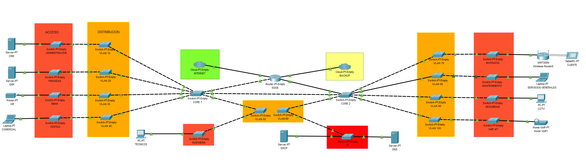

# Architecture Guide

## Contents

- [Architecture Guide](#architecture-guide)
  - [⚙️ System Overview](#️-system-overview)
  - [📊 Diagram](#-diagram)
  - [🔗 Component Interactions](#-component-interactions)
  - [⚠️ Critical Points and Scaling](#️-critical-points-and-scaling)
    - [Load Distribution Among Network Components](#load-distribution-among-network-components)
  - [📈 Data Flow](#-data-flow)
    - [Flow Diagram](#flow-diagram)
  - [🔄 Overall Flow Explained](#-overall-flow-explained)
    - [Emphasizing Real-Time Data Routing and Updates](#emphasizing-real-time-data-routing-and-updates)
    - [🚀 CI/CD Pipeline with Cisco DevOps Tools](#-cicd-pipeline-with-cisco-devops-tools)
      - [1. **Setting Up the Workflow**](#1-setting-up-the-workflow)
      - [2. **Network Configuration Testing**](#2-network-configuration-testing)
      - [3. **Deployment and Monitoring**](#3-deployment-and-monitoring)
      - [4. **Automated Compliance Checks**](#4-automated-compliance-checks)
      - [5. **Notifications**](#5-notifications)
    - [Final Considerations](#final-considerations)
  - [🎯 Overall Goals and Benefits](#-overall-goals-and-benefits)
  - [📊 Critical Metrics for End-to-End Network Health and Performance](#-critical-metrics-for-end-to-end-network-health-and-performance)
    - [Suggested Metrics to Monitor](#suggested-metrics-to-monitor)
  - [📈 Monitoring and Logging](#-monitoring-and-logging)
    - [Accessing Logs](#accessing-logs)
  - [➡️ Security](#️-security)
    - [Authentication Techniques](#authentication-techniques)
  - [✏️ Additional Considerations](#️-additional-considerations)

## ⚙️ System Overview

- **Target Audience**: Network engineering teams managing and optimizing Cisco infrastructures.
  
- **Use Case**: Integrates Cisco technologies like **routers**, **switches**, **firewalls**, and **Cisco DNA Center**.

- **Reliability and Availability**: **Cisco Meraki**, **Cisco Umbrella**, and **Cisco Secure** enhance real-time threat protection.

## 📊 Diagram

- Diagram with **Cisco Network Topology Icons** or **draw.io** shows the Cisco network architecture.

1. **Cisco Routers**: Route between network segments.
2. **Cisco Switches**: Manage local connections.
3. **Cisco Firewalls**: Protect network perimeters.
4. **Cisco DNA Center**: Centralized management and monitoring.
5. **Cisco ACI**: Data center automation.

- Use tool **Cisco Packet Tracer**, to create this topology.



## 🔗 Component Interactions

- **Routers** route traffic, **switches** distribute it, **firewalls** secure it, and **Cisco DNA Center** monitors network performance.
- **Cisco ACI** manages data center policies and connectivity.

## ⚠️ Critical Points and Scaling

Scale network resources and distribute load effectively.

### Load Distribution Among Network Components

1. **Load Balancing**:
   - Use **Cisco ASA** and **F5** for load balancing.
   
2. **Cisco ACI Scalability**:
   - **ACI pods** provide horizontal scalability.

## 📈 Data Flow

1. User connections are routed.
2. Network devices handle data routing and firewall inspections.

### Flow Diagram


```plaintext
[ User Requests ]
         |
         v
[ Cisco Router ]
         |
         v
[ Cisco Switch ]
         |
         v
[ Cisco Firewall ]

```

## 🔄 Overall Flow Explained

### Routing and Switching:
- **Routers**: Manage distribution of network segments, directing traffic across different parts of the network.
- **Switches**: Handle local connections within the network, ensuring data reaches the correct endpoints efficiently.

### Security and Monitoring:
- **Cisco Firewalls**: Secure the network perimeter and control access to protect against unauthorized connections and potential threats.
- **Cisco DNA Center**: Continuously monitors network configurations and optimizes performance to enhance reliability and uptime.

### Emphasizing Real-Time Data Routing and Updates:
- **Cisco DNA Analytics**: Provides proactive adjustments based on real-time data analysis, helping to anticipate and prevent issues.
- **Cisco Umbrella**: Adds an additional layer of network protection, guarding against online threats and ensuring secure connections.

## 🚀 CI/CD Pipeline with Cisco DevOps Tools

A continuous integration and delivery (CI/CD) pipeline facilitates smooth updates to network configurations, ensuring minimal disruption.

1. **Setting Up the Workflow**
   - Use **Cisco DNA Center** to automate and standardize configuration management across the network.

2. **Network Configuration Testing**
   - Verify compliance and consistency of configurations before deployment to ensure alignment with security and operational policies.

3. **Deployment and Monitoring**
   - Deploy configuration changes across network devices and continuously monitor their impact on network performance.

4. **Automated Compliance Checks**
   - Utilize **Cisco Stealthwatch** for real-time compliance verification, ensuring that configurations adhere to regulatory and security standards.

5. **Notifications**
   - Set up alerts for any configuration changes, helping teams stay informed and respond promptly to critical updates or issues.

### Final Considerations
- **Secrets Management**: Cisco DNA Center secures access to configurations with keys and tokens, ensuring data protection and restricted access.
- **Configuration Versioning**: Track and manage different configuration versions, enabling rollback to previous configurations if necessary.

## 🎯 Overall Goals and Benefits

### Scalability:
- Load balancing distributes high traffic loads across devices, optimizing network resources.

### Flexibility:
- **Cisco ACI** allows for streamlined updates and adjustments, enabling adaptable network changes with minimal disruptions.

## 📊 Critical Metrics for End-to-End Network Health and Performance

Tracking these key metrics is essential for maintaining optimal network performance and health:

### Suggested Metrics to Monitor:
- **Latency**: Measure delays in data transmission to identify bottlenecks.
- **Traffic Volume**: Monitor the amount of data flowing through the network to prevent overloads.
- **Device Health**: Assess the status and performance of network devices to ensure operational stability.

## 📈 Monitoring and Logging

Cisco provides tools for real-time network monitoring to detect issues early and ensure high performance.

### Accessing Logs
- **Cisco DNA Center**: Provides access to detailed logs on events and performance metrics, offering insights for troubleshooting and optimization.

## ➡️ Security

Comprehensive security measures are implemented, including firewalls, authentication protocols, and real-time protection tools.

### Authentication Techniques
- **Cisco ISE**: Manages and controls network access for devices, ensuring only authorized connections.
- **MFA (Multi-Factor Authentication)**: Adds an extra layer of security for both users and administrators, reducing risks of unauthorized access.

## ✏️ Additional Considerations

- **Microservices Architecture**: With **Cisco ACI**, the network gains enhanced flexibility, allowing for efficient scaling and adaptability in response to network demands.
